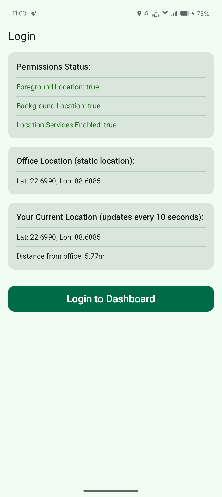
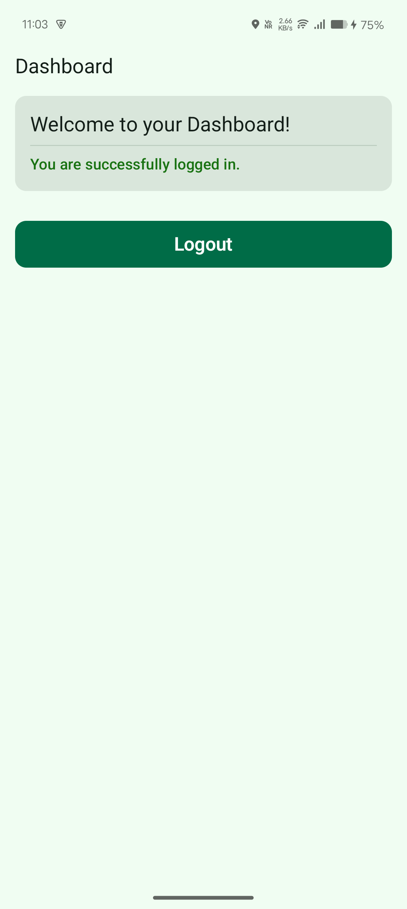

# Location-Based Office Login App

An Android application built with Jetpack Compose that facilitates secure office login based on the user's geographical proximity to a predefined office location. The app continuously monitors the user's location, displays it in real-time, calculates the distance to the office, and can continue monitoring location in the background after successful login.

## 🚀 Features

* **Real-time Location Display:** Shows the user's current Latitude, Longitude, and the device's location accuracy (or distance to office, as configured).
* **Dynamic Distance Calculation:** Displays the live distance between the user's current location and the predefined office location.
* **Office Perimeter Check:** Allows login only if the user is within a specified radius (perimeter) of the office location.
* **Foreground Service for Background Monitoring:** After successful login, the app can continue monitoring the user's location in the background using a foreground service.
* **Permission Management:** Handles Android's location permission requests (foreground and background) and prompts the user to enable location services.
* **Intuitive UI:** Built with Jetpack Compose for a modern and reactive user interface.
* **MVVM Architecture:** Follows the Model-View-ViewModel architecture for clean separation of concerns and testability.
* **Kotlin Coroutines & Flows:** Utilizes Kotlin Coroutines and StateFlow/SharedFlow for asynchronous operations and reactive UI updates.

## 📸 Screenshots

*(You can add screenshots of your app here. For example:)*
| Login Screen (Initial) | Login Screen (Location Updated) | Login Screen (Permission Denied) |
| :----------------------: | :-----------------------------: | :--------------------------------: |
|  |  |  |

## 🛠️ Prerequisites

Before you begin, ensure you have the following installed:

* **Android Studio Flamingo | 2022.2.1 or newer:** Recommended for Jetpack Compose development.
* **Android SDK:** API Level 31+ (or the target SDK version specified in `build.gradle`).
* **Kotlin Plugin:** Installed in Android Studio.
* **Gradle:** Automatically managed by Android Studio.

## ⚙️ Installation & Setup

1.  **Clone the Repository:**
    ```bash
    git clone [https://github.com/bijumondal18/location_based_login_assignment_jetpack_compose.git](https://github.com/bijumondal18/location_based_login_assignment_jetpack_compose.git)
    cd location_based_login_assignment_jetpack_compose
    ```

2.  **Open in Android Studio:**
    * Launch Android Studio.
    * Select `File` > `Open...` and navigate to the cloned `location_based_login_assignment_jetpack_compose` directory.

3.  **Sync Gradle Project:**
    * Android Studio will automatically prompt you to sync the Gradle project. If not, click on the "Sync Project with Gradle Files" button in the toolbar (usually a small elephant icon).

4.  **Build and Run:**
    * Connect an Android device or start an AVD (Android Virtual Device) emulator.
    * Click the "Run" button (green play icon) in the Android Studio toolbar to build and install the app on your selected device/emulator.

## 💡 Usage

### For Developers (Configuration)

The core application logic, including the office location and perimeter, is defined in `utils/Constants.kt`.

* **Office Location:**
    ```kotlin
    // utils/Constants.kt
    val OFFICE_LATLNG = LatLng(22.6990, 88.6885) // Example: Berachampa coordinates
    const val OFFICE_PERIMETER_METERS = 80.0 // 80 meters radius
    ```
    You can change `OFFICE_LATLNG` to your desired office coordinates and adjust `OFFICE_PERIMETER_METERS` to set the login radius.

* **Location Update Intervals:**
    ```kotlin
    // utils/Constants.kt
    const val LOCATION_UPDATE_INTERVAL_MS = 10000L // UI updates every 10 seconds
    const val FASTEST_LOCATION_UPDATE_INTERVAL_MS = 5000L // Fastest interval for updates every 5 seconds
    ```
    These control how frequently the app requests and displays location updates.

### For End-Users

1.  **Launch the App:** Open the "Office Login" app from your device's app drawer.
2.  **Grant Permissions:**
    * The app will request **"Allow `App Name` to access this device's location?"**. Select `Allow while using the app`.
    * Depending on your Android version, it might also ask for **"Allow `App Name` to access this device's location all the time?"** for background monitoring after login. Select `Allow all the time` for full functionality.
    * **Crucially:** Ensure **Location Services (GPS)** is enabled on your device. The app will prompt you to enable it if it's off, and provide a button to open settings.
3.  **Observe Location:** On the login screen, you'll see:
    * Your current Latitude and Longitude.
    * "Distance from office:" which shows how far you are from the predefined office location, updating every 5 seconds.
    * Permission and Location Service status indicators (Green for granted/enabled, Red for not).
4.  **Login:**
    * If you are within the `OFFICE_PERIMETER_METERS` of the `OFFICE_LATLNG`, the "Login to Dashboard" button will become active.
    * Tap "Login to Dashboard" to simulate a successful login.
5.  **Background Monitoring:** After logging in, the app will start a foreground service to continue monitoring your location in the background (if background location permission was granted). This is indicated by a persistent notification.
6.  **Logout/Close:** The app currently simulates login. To stop background monitoring, you would typically force-stop the app or implement a logout button that stops the service.

## 📂 Project Structure (Key Components)

* `app/src/main/java/com/yourcompany/locationbasedlogin/`
    * `data/model/`: Data classes (e.g., `LocationData`).
    * `data/repository/`: Data sources and logic for fetching data (e.g., `AuthRepository`, `LocationRepository`).
    * `service/`: Foreground service for background location monitoring (`LocationMonitoringService`).
    * `ui/screens/login/`: Contains the `LoginScreen.kt` Composable and `LoginViewModel.kt`.
    * `ui/theme/`: Jetpack Compose theming.
    * `utils/`: Helper classes (e.g., `Constants.kt`, `LocationUtils.kt` for distance calculation, `PermissionsUtils.kt`).
* `app/src/main/AndroidManifest.xml`: Declares permissions, activities, and services.
* `app/build.gradle.kts`: Project dependencies and configuration.

## 🤝 Contributing

Feel free to fork this repository, open issues, and submit pull requests.

## 📄 License

This project is open-sourced under the MIT License. See the `LICENSE` file for more details.
